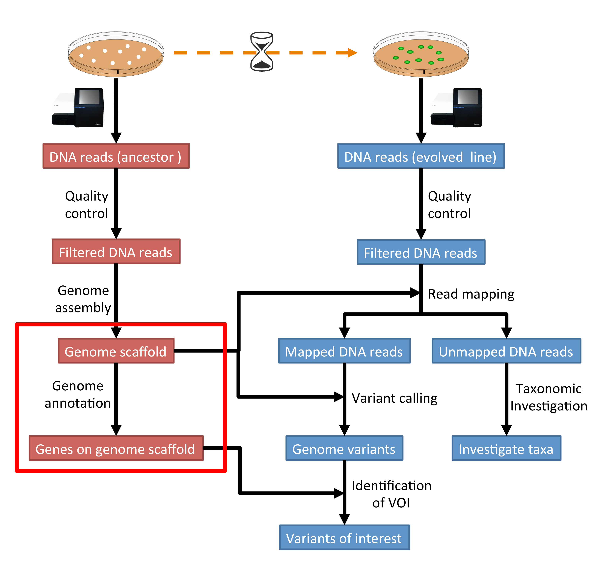

.. _ngs-annotation:

Genome annotation
=================

Preface
-------

In this section you will predict genes and assess your assembly using |augustus| and |busco|, as well as |prokka|.

.. .. Attention::

..    The annotation process will take up to 90 minutes. Start it as soon as possible.

.. NOTE::

   You will encounter some **To-do** sections at times. Write the solutions and answers into a text-file.   

Overview
--------

The part of the workflow we will work on in this section can be viewed in :numref:`fig-workflow-anno`.

.. _fig-workflow-anno:

   The part of the workflow we will work on in this section marked in red.

Learning outcomes
-----------------

After studying this section of the tutorial you should be able to:

#. Explain how annotation completeness is assessed using orthologues
#. Use bioinformatics tools to perform gene prediction
#. Use genome-viewing software to graphically explore genome annotations and NGS data overlays 

Before we start
---------------

Lets see how our directory structure looks so far:

.. code:: sh

    $ cd ~/analysis
    $ ls -1F

.. code:: sh

    assembly/
    data/
    kraken/
    mappings/
    multiqc_data/
    trimmed/
    trimmed-fastqc/
    variants/

Installing the software
-----------------------

.. code:: sh

    # activate the env
    $ conda create --yes -n anno busco

This will install both the |augustus| [STANKE2005]_ and the |busco| [SIMAO2015]_ software, which we will use (separately) for gene prediction and assessment of assembly completeness, respectively.

Make a directory for the annotation results:

.. code:: sh

    $ mkdir annotation
    $ cd annotation

We need to get the database that |busco| will use to assess orthologue presence absence in our genome annotation.
|busco| provides a command to list all available datasets and download datasets.

.. code:: sh

    $ busco --list-datasets

.. code:: sh

    INFO:   Downloading information on latest versions of BUSCO data...

    ################################################

    Datasets available to be used with BUSCOv4 as of 2019/11/27:

    bacteria_odb10
        - acidobacteria_odb10
        - actinobacteria_phylum_odb10
            - actinobacteria_class_odb10
                - corynebacteriales_odb10
                - micrococcales_odb10
                - propionibacteriales_odb10
                - streptomycetales_odb10
                - streptosporangiales_odb10
            - coriobacteriia_odb10
                - coriobacteriales_odb10
    ...

|Busco| will download the dataset when starting an analysis.

We also need to place the configuration file for this program in a location in which we have "write" privileges.
Do this recursively for the entire config directory, placing it into your current annotation directory:

.. code:: sh

    $ cp -r ~/miniconda3/envs/anno/config/ .

Assessment of orthologue presence and absence
---------------------------------------------

|busco| will assess orthologue presence absence using |blastn|, a rapid method of finding close matches in large databases (we will discuss this in lecture).
It uses |blastn| to make sure that it does not miss any part of any possible coding sequences. To run the program, we give it

- A fasta format input file
- A name for the output files
- The name of the lineage database against which we are assessing orthologue presence absence (that we downloaded above)
- An indication of the type of annotation we are doing (genomic, as opposed to transcriptomic or previously annotated protein files).
- The config file to use

.. code:: sh
  
    $ busco  -i ../assembly/scaffolds.fasta -o my_anno -l bacteria_odb10 -m geno --config config/config.ini

Navigate into the output directory you created.
There are many directories and files in there containing information on the orthologues that were found, but here we are only really interested in one: the summary statistics.
This is located in the ``short_summary*.txt`` file.
Look at this file.
It will note the total number of orthologues found, the number expected, and the number missing.
This gives an indication of your genome completeness.

.. TODO::

   Is it necessarily true that your assembly is incomplete if it is missing some orthologues? Why or why not?

Annotation with |augustus|
--------------------------

We will use |augustus| to perform gene prediction.
This program implements a hidden markov model (HMM) to infer where genes lie in the assembly you have made.
To run the program you need to give it:

- Information as to whether you would like the genes called on both strands (or just the forward or reverse strands)
- A “model” organism on which it can base it’s HMM parameters on (in this case we will use S. cerevisiae)
- The location of the assembly file
- A name for the output file, which will be a .gff (general feature format) file.
- We will also tell it to display a progress bar as it moves through the genome assembly.

.. code:: sh
  
    $ augustus --progress=true --strand=both --species=E_coli_K12 --AUGUSTUS_CONFIG_PATH=config ../assembly/scaffolds.fasta > my_new_bacteria.gff 

.. note:: 

   Should the process of producing your annotation fail, you can download a
   annotation manually from :ref:`downloads`. Remember to unzip the file.

Annotation with |prokka|
------------------------

Install |prokka|:

.. code:: sh

    $ conda create --yes -n prokka prokka
    $ conda activate prokka

Run |prokka|:

.. code:: sh

    $ prokka --kingdom Bacteria --genus Escherichia --species coli --outdir annotation_prokka assembly/scaffolds.fasta

Your results will be in the ``annotation_prokka`` directory. 

Interactive viewing
-------------------

We will use the software |igv| to view the assembly, the gene predictions you have made, and the variants that you have called, all in one window. 

|igv|
~~~~~

.. code:: sh

    $ conda activate anno
    $ conda install --yes igv

.. We will not install this software using |conda|.
.. Instead, make a new directory in your home directory entitled “software”, and change into this directory.
.. You will have to download the software from the Broad Institute:

.. .. code:: sh

..           mkdir software
..           cd software
..           wget http://data.broadinstitute.org/igv/projects/downloads/2.4/IGV_2.4.10.zip

..           # unzip the software:
..           unzip IGV_2.4.10.zip

..           # and change into that directory.
..           cd IGV_2.4.10.zip
          
..           # To run the interactive GUI, you will need to run the sh script in that directory:
..           sh igv.sh

.. .. note::

..    Should the download fail, download manually from :ref:`downloads`.

To run IGV type:

.. code:: sh

    $ igv
                
This will open up a new window.
Navigate to that window and open up your genome assembly:

- **Genomes** -> **Load Genome from File**
- Load your assembly (``scaffolds.fasta``), not your gff file.

Load the tracks:

- **File** -> **Load from File**
- Load your unzipped ``vcf`` file from last week
- Load your unzipped ``gff`` file from this week.

At this point you should be able to zoom in and out to see regions in which there are SNPs or other types of variants.
You can also see the predicted genes.
If you zoom in far enough, you can see the sequence (DNA and protein).

If you have time and interest, you can right click on the sequence and copy it.
Open a new browser window and go to the blastn homepage.
There, you can blast your gene of interest (GOI) and see if blast can assign a function to it.

The end goal of this lab will be for you to select a variant that you feel is interesting (e.g. due to the gene it falls near or within), and hypothesize as to why that mutation might have increased in frequency in these evolving populations.

.. This is not working as the chomosome names are obviously differnt to the one in our scaffold
.. Investigate variants with known annotation
.. ------------------------------------------

.. .. todo::

..     Go to the `Ensembl website <http://bacteria.ensembl.org/>`__ and download the gff annotation for the E.coli strain with taxid: 413997. Load the annotation as well ion IGV. Check your SNPs.

.. only:: html

   .. rubric:: References

.. [SIMAO2015] Simao FA, Waterhouse RM, Ioannidis P, Kriventseva EV and Zdobnov EM. BUSCO: assessing genome assembly and annotation completeness with single-copy orthologs. `Bioinformatics, 2015, Oct 1;31(19):3210-2 <http://doi.org/10.1093/bioinformatics/btv351>`__

.. [STANKE2005] Stanke M and Morgenstern B. AUGUSTUS: a web server for gene prediction in eukaryotes that allows user-defined constraints. `Nucleic Acids Res, 2005, 33(Web Server issue): W465–W467. <https://dx.doi.org/10.1093/nar/gki458>`__
