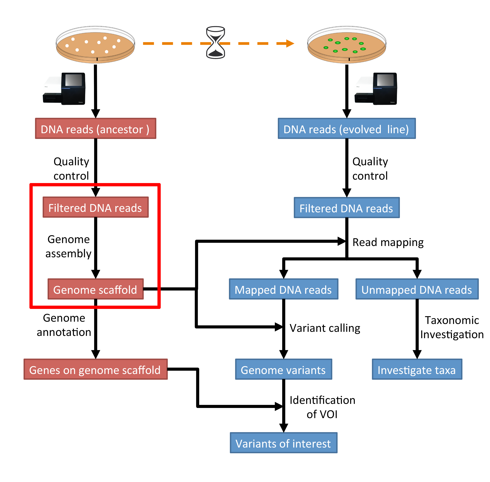

.. _ngs-assembly:

Genome assembly
===============

Preface
-------

In this section we will use our skill on the command-line interface to create a genome assembly from sequencing data.

.. There is an accompanying lecture for this tutorial (`Genome Assembly: An Introduction <https://dx.doi.org/10.6084/m9.figshare.2972323.v1>`__).

.. NOTE::

   You will encounter some **To-do** sections at times. Write the solutions and answers into a text-file.

Overview
--------

The part of the workflow we will work on in this section can be viewed in :numref:`fig-workflow-assembly`.

.. _fig-workflow-assembly:

   The part of the workflow we will work on in this section marked in red.

Learning outcomes
-----------------

After studying this tutorial you should be able to:

#. Compute and interpret a whole genome assembly.
#. Judge the quality of a genome assembly.

Before we start
---------------

Lets see how our directory structure looks so far:

.. code:: bash

    $ cd ~/analysis
    $ ls -1F

.. code:: bash

    data/
    multiqc_data/
    multiqc_report.html
    trimmed/
    trimmed-fastqc/

.. attention::

    If you have not run the previous section :ref:`ngs-qc`, you can download the trimmed data needed for this section here: :ref:`downloads`.

.. Subsampling reads
.. ~~~~~~~~~~~~~~~~~

.. Due to the size of the data sets you may find that the assembly takes a lot of time to complete, especially on older hardware.
.. To mitigate this problem we can randomly select a subset of sequences we are going to use at this stage of the tutorial.
.. To do this we will install another program:

.. .. code::

..     $ conda install seqtk

.. Now that ``seqtk`` has been installed, we are going to sample 10% of the original reads:

.. .. code::

..     # change directory
..     cd ~/analysis
..     # create directory
..     mkdir sampled

..     # sub sample reads
..     seqtk sample -s11 trimmed/ancestor-R1.trimmed.fastq.gz 0.1 | gzip > sampled/ancestor-R1.trimmed.fastq.gz
..     seqtk sample -s11 trimmed/ancestor-R2.trimmed.fastq.gz 0.1 | gzip > sampled/ancestor-R2.trimmed.fastq.gz

.. In the commands below you need to change the input directory from ``trimmed/`` to ``sampled/``.

.. .. note:: The ``-s`` options needs to be the same value for file 1 and file 2 to samples the reads that belong to each other. It specified the seed value for the random number generator.

.. .. note:: It should be noted that by reducing the amount of reads that go into the assembly, we are loosing information that could otherwise be used to make the assembly. Thus, the assembly will be likely "much" worse than when using the complete dataset.

Creating a genome assembly
--------------------------

We want to create a genome assembly for our ancestor.
We are going to use the quality trimmed forward and backward DNA sequences and
use a program called |spades| to build a genome assembly.

.. todo::

   #. Discuss briefly why we are using the ancestral sequences to create a
      reference genome as opposed to the evolved line.

Installing the software
~~~~~~~~~~~~~~~~~~~~~~~

We are going to use a program called |spades| fo assembling our genome.
In a recent evaluation of assembly software, |spades| was found to be a good
choice for fungal genomes [ABBAS2014]_.
It is also simple to install and use.

.. code:: bash

    $ conda create -n assembly spades quast
    $ conda activate assembly

SPAdes usage
~~~~~~~~~~~~

.. code:: bash

    # change to your analysis root folder
    $ cd ~/analysis

    # first create a output directory for the assemblies
    $ mkdir assembly

    # to get a help for spades and an overview of the parameter type:
    $ spades.py -h

Generally, paired-end data is submitted in the following way to |spades|:

.. code:: bash

    $ spades.py -o result-directory -1 read1.fastq.gz -2 read2.fastq.gz 

.. todo::

   #. Run |spades| with default parameters on the ancestor's trimmed reads
   #. Read in the |spades| manual about about assembling with 2x150bp reads
   #. Run |spades| a second time but use the options suggested at the |spades| manual `section 3.4 <http://cab.spbu.ru/files/release3.14.0/manual.html#sec3.4>`__ for assembling 2x150bp paired-end reads. Use a different output directory ``assembly/spades-150`` for this run.

.. hint::

   Should you not get it right, try the commands in :ref:`code-assembly1`.

Assembly quality assessment
---------------------------

Assembly statistics
~~~~~~~~~~~~~~~~~~~

|quast| (QUality ASsessment Tool) [GUREVICH2013]_, evaluates genome assemblies by computing various metrics, including:

-  N50: length for which the collection of all contigs of that length or
   longer covers at least 50% of assembly length
-  NG50: where length of the reference genome is being covered
-  NA50 and NGA50: where aligned blocks instead of contigs are taken
-  miss-assemblies: miss-assembled and unaligned contigs or contigs bases
-  genes and operons covered

It is easy with |quast| to compare these measures among several assemblies.
The program can be used on their `website <http://quast.bioinf.spbau.ru/>`__.

.. code:: bash

    $ conda install quast

Run |quast| with both assembly scaffolds.fasta files to compare the results.

.. code:: bash

    $ quast -o assembly/quast assembly/spades-default/scaffolds.fasta assembly/spades-150/scaffolds.fasta

.. todo::

   #. Compare the results of |quast| with regards to the two different assemblies.
   #. Which one do you prefer and why?

Compare the untrimmed data
--------------------------

.. todo::
   #. To see if our trimming procedure has an influence on our assembly, run the same command you used on the trimmed data on the original untrimmed data.
   #. Run |quast| on the assembly and compare the statistics to the one derived for the trimmed data set. Write down your observations.

.. hint::

   Should you not get it right, try the commands in :ref:`code-assembly2`.

Further reading
---------------

Background on Genome Assemblies
~~~~~~~~~~~~~~~~~~~~~~~~~~~~~~~

-  How to apply de Bruijn graphs to genome assembly. [COMPEAU2011]_
-  Sequence assembly demystified. [NAGARAJAN2013]_

Evaluation of Genome Assembly Software
~~~~~~~~~~~~~~~~~~~~~~~~~~~~~~~~~~~~~~

- GAGE: A critical evaluation of genome assemblies and assembly algorithms. [SALZBERG2012]_
- Assessment of de novo assemblers for draft genomes: a case study with fungal genomes. [ABBAS2014]_

Web links
---------

- Lectures for this topic: `Genome Assembly: An Introduction <https://dx.doi.org/10.6084/m9.figshare.2972323.v1>`__
- |spades|
- `Quast <http://quast.bioinf.spbau.ru/>`__
- `Bandage <https://rrwick.github.io/Bandage/>`__ (Bioinformatics Application for Navigating De novo Assembly Graphs Easily) is a program that visualizes a genome assembly as a graph [WICK2015]_.

.. only:: html

   .. rubric:: References

.. [ABBAS2014] Abbas MM, Malluhi QM, Balakrishnan P. Assessment of de novo assemblers for draft genomes: a case study with fungal genomes. `BMC Genomics. 2014;15 Suppl 9:S10. <https://www.ncbi.nlm.nih.gov/pmc/articles/PMC4290589/>`__ doi: 10.1186/1471-2164-15-S9-S10. Epub 2014 Dec 8.

.. [COMPEAU2011] Compeau PE, Pevzner PA, Tesler G. How to apply de Bruijn graphs to genome assembly. `Nat Biotechnol. 2011 Nov 8;29(11):987-91 <http://dx.doi.org/10.1038/nbt.2023>`__

.. [GUREVICH2013] Gurevich A, Saveliev V, Vyahhi N and Tesler G. QUAST: quality assessment tool for genome assemblies. `Bioinformatics 2013, 29(8), 1072-1075 <http://bioinformatics.oxfordjournals.org/content/29/8/1072>`__

.. [NAGARAJAN2013] Nagarajan N, Pop M. Sequence assembly demystified. `Nat Rev Genet. 2013 Mar;14(3):157-67 <http://dx.doi.org/10.1038/nrg3367>`__

.. [SALZBERG2012] Salzberg SL, Phillippy AM, Zimin A, Puiu D, Magoc T, Koren S, Treangen TJ, Schatz MC, Delcher AL, Roberts M, Marçais G, Pop M, Yorke JA. GAGE: A critical evaluation of genome assemblies and assembly algorithms. `Genome Res. 2012 Mar;22(3):557-67 <http://genome.cshlp.org/content/22/3/557.full?sid=59ea80f7-b408-4a38-9888-3737bc670876>`__

.. [WICK2015] Wick RR, Schultz MB, Zobel J and Holt KE. Bandage: interactive visualization of de novo genome assemblies. `Bioinformatics 2015, 10.1093/bioinformatics/btv383 <http://bioinformatics.oxfordjournals.org/content/early/2015/07/11/bioinformatics.btv383.long>`__

