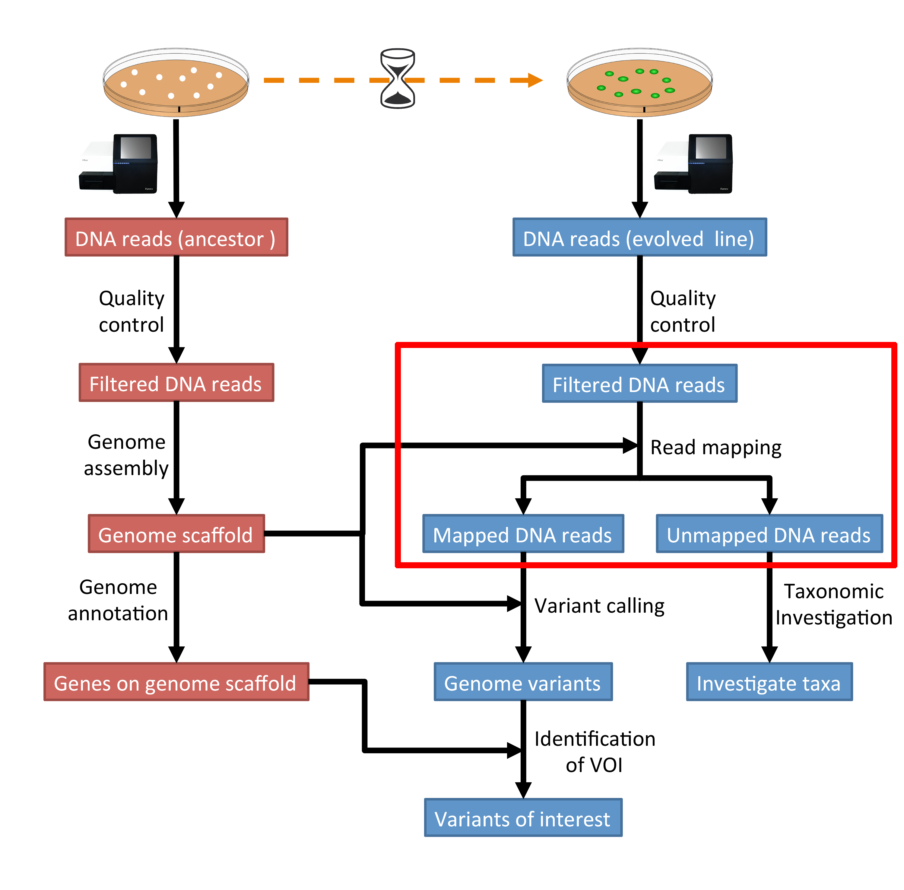
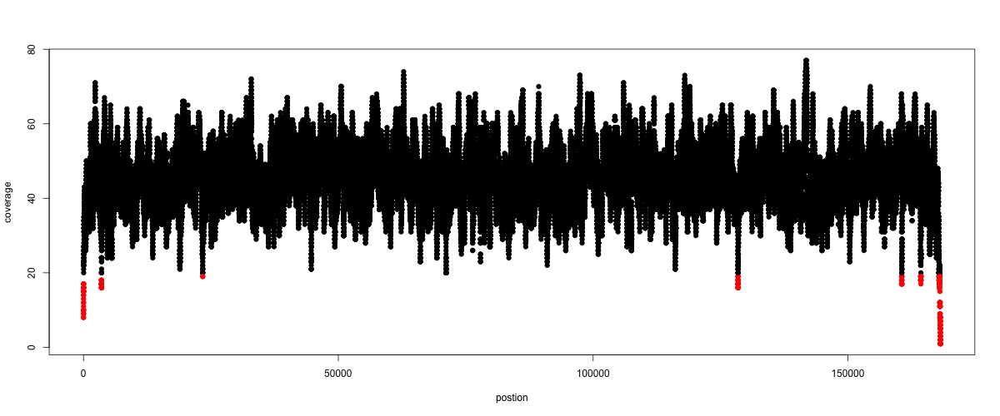

.. _ngs-mapping:

Read mapping
============

Preface
-------

In this section we will use our skill on the command-line interface to map our
reads from the evolved line to our ancestral reference genome.

.. The first part of the following lecture is of importance to this tutorial (`ChIP - An Introduction <https://doi.org/10.6084/m9.figshare.1554130.v1>`__).

.. NOTE::

   You will encounter some **To-do** sections at times. Write the solutions and answers into a text-file.

Overview
--------

The part of the workflow we will work on in this section can be viewed in :numref:`fig-workflow-map`.

.. _fig-workflow-map:

   The part of the workflow we will work on in this section marked in red.

Learning outcomes
-----------------

After studying this section of the tutorial you should be able to:

#. Explain the process of sequence read mapping.
#. Use bioinformatics tools to map sequencing reads to a reference genome.
#. Filter mapped reads based on quality.

Before we start
---------------

Lets see how our directory structure looks so far:

.. code:: bash

          $ cd ~/analysis
          # create a mapping result directory
          $ mkdir mappings
          $ ls -1F

.. code:: bash

          assembly/
          data/
          mappings/
          multiqc_data/
          multiqc_report.html
          trimmed/
          trimmed-fastqc/

.. attention::

    If you sampled reads randomly for the assembly tutorial in the last section, please go and download first the assembly on the full data set. This can be found under :ref:`downloads`. Unarchive and uncompress the files with ``tar -xvzf assembly.tar.gz``.

Mapping sequence reads to a reference genome
--------------------------------------------

We want to map the sequencing reads to the ancestral reference genome.
We are going to use the quality trimmed forward and backward DNA sequences of the evolved line and use a program called |bwa| to map the reads.

.. todo::

   #. Discuss briefly why we are using the ancestral genome as a reference genome as opposed to a genome for the evolved line.

Downloading the reference genome assembly
~~~~~~~~~~~~~~~~~~~~~~~~~~~~~~~~~~~~~~~~~

.. todo::

   In the assembly section at ":ref:`ngs-assembly`", we created a genome assembly. However, we actually used sub-sampled data as otherwise the assemblies would have taken a long time to finish. To continue, please download the assembly created on the complete dataset (:ref:`downloads`). Unarchive and uncompress the files with ``tar -xvzf assembly.tar.gz``.

Installing the software
~~~~~~~~~~~~~~~~~~~~~~~

We are going to use a program called |bwa| to map our reads to our genome.

It is simple to install and use.

.. code:: bash

    $ conda create --yes -n mapping samtools bwa qualimap r-base
    $ conda activate mapping

BWA
---

Overview
~~~~~~~~

|bwa| is a short read aligner, that can take a reference genome and map single- or paired-end sequence data to it [LI2009]_.
It requires an indexing step in which one supplies the reference genome and |bwa| will create an index that in the subsequent steps will be used for aligning the reads to the reference genome.
While this step can take some time, the good thing is the index can be reused over and over.
The general command structure of the |bwa| tools we are going to use are shown below:

.. code:: bash

   # bwa index help
   $ bwa index

   # indexing
   $ bwa index path/to/reference-genome.fa

   # bwa mem help
   $ bwa mem

   # single-end mapping, general command structure, adjust to your case
   $ bwa mem path/to/reference-genome.fa path/to/reads.fq.gz > path/to/aln-se.sam

   # paired-end mapping, general command structure, adjust to your case
   $ bwa mem path/to/reference-genome.fa path/to/read1.fq.gz path/to/read2.fq.gz > path/to/aln-pe.sam

Creating a reference index for mapping
~~~~~~~~~~~~~~~~~~~~~~~~~~~~~~~~~~~~~~

.. todo::

   Create an |bwa| index for our reference genome assembly. Attention! Remember which file you need to submit to |bwa|.

.. hint::

   Should you not get it right, try the commands in :ref:`code-bwa1`.

.. note::

   Should you be unable to run |bwa| indexing on the data, you can download the index from :ref:`downloads`. Unarchive and uncompress the files with ``tar -xvzf bwa-index.tar.gz``.

Mapping reads in a paired-end manner
~~~~~~~~~~~~~~~~~~~~~~~~~~~~~~~~~~~~

Now that we have created our index, it is time to map the trimmed sequencing reads of our two evolved line to the reference genome.

.. todo::

   Use the correct ``bwa mem`` command structure from above and map the reads of the two evolved line to the reference genome.

.. hint::

   Should you not get it right, try the commands in :ref:`code-bwa2`.

.. Bowtie2 (alternative to BWA)
.. ----------------------------

.. .. Attention::

..    If the mapping did not succeed with |bwa|. We can use the aligner |bowtie|, explained in this section. If the mapping with |bwa| did work, you can jump straight ahead to :numref:`sam-file-format`.

.. Install with:

.. .. code:: bash

..     $ conda activate mapping
..     $ conda install --yes bowtie2

.. Overview
.. ~~~~~~~~

.. |bowtie| is a short read aligner, that can take a reference genome and map single- or paired-end data to it [TRAPNELL2009]_.
.. It requires an indexing step in which one supplies the reference genome and |bowtie| will create an index that in the subsequent steps will be used for aligning the reads to the reference genome.
.. The general command structure of the |bowtie| tools we are going to use are shown below:

.. .. code:: bash

..    # bowtie2 help
..    $ bowtie2-build

..    # indexing
..    $ bowtie2-build genome.fasta /path/to/index/prefix

..    # paired-end mapping
..    $ bowtie2 -X 1000 -x /path/to/index/prefix -1 read1.fq.gz -2 read2.fq.gz -S aln-pe.sam

.. - ``-X``: Adjust the maximum fragment size (length of paired-end alignments + insert size) to 1000bp. This might be useful if you do not know the exact insert size of your data. The |bowtie| default is set to 500 which is `often considered too short <http://lab.loman.net/2013/05/02/use-x-with-bowtie2-to-set-minimum-and-maximum-insert-sizes-for-nextera-libraries/>`__.

.. Creating a reference index for mapping
.. ~~~~~~~~~~~~~~~~~~~~~~~~~~~~~~~~~~~~~~

.. .. todo::

..    Create an |bowtie| index for our reference genome assembly. Attention! Remember which file you need to submit to |bowtie|.

.. .. hint::

..    Should you not get it right, try the commands in :ref:`code-bowtie1`.

.. .. note::

..    Should you be unable to run |bowtie| indexing on the data, you can download the index from :ref:`downloads`. Unarchive and uncompress the files with ``tar -xvzf bowtie2-index.tar.gz``.

.. Mapping reads in a paired-end manner
.. ~~~~~~~~~~~~~~~~~~~~~~~~~~~~~~~~~~~~

.. Now that we have created our index, it is time to map the filtered and trimmed sequencing reads of our evolved line to the reference genome.

.. .. todo::

..    Use the correct ``bowtie2`` command structure from above and map the reads of the evolved line to the reference genome.

.. .. hint::

..    Should you not get it right, try the commands in :ref:`code-bowtie2`.

.. .. note::

..    |bowtie| does give very cryptic error messages without telling much why it did not want to run. The most likely reason is that you specified the paths to the files and result file wrongly. Check this first. Use tab completion a lot!

.. _sam-file-format:

The sam mapping file-format
---------------------------

|bwa| and |bowtie| will produce a mapping file in sam-format. Have a look into the sam-file that was created by either program.
A quick overview of the sam-format can be found `here <http://bio-bwa.sourceforge.net/bwa.shtml#4>`__ and even more information can be found `here <http://samtools.github.io/hts-specs/SAMv1.pdf>`__.
Briefly, first there are a lot of header lines. Then, for each read, that mapped to the reference, there is one line.

The columns of such a line in the mapping file are described in :numref:`table-sam`.

.. _table-sam:
.. table:: The sam-file format fields.

   +-----+---------+-----------------------------------------------------------+
   | Col |  Field  | Description                                               |
   +=====+=========+===========================================================+
   | 1   | QNAME   | Query (pair) NAME                                         |
   +-----+---------+-----------------------------------------------------------+
   | 2   | FLAG    | bitwise FLAG                                              |
   +-----+---------+-----------------------------------------------------------+
   | 3   | RNAME   | Reference sequence NAME                                   |
   +-----+---------+-----------------------------------------------------------+
   | 4   | POS     | 1-based leftmost POSition/coordinate of clipped sequence  |
   +-----+---------+-----------------------------------------------------------+
   | 5   | MAPQ    | MAPping Quality (Phred-scaled)                            |
   +-----+---------+-----------------------------------------------------------+
   | 6   | CIAGR   | extended CIGAR string                                     |
   +-----+---------+-----------------------------------------------------------+
   | 7   | MRNM    | Mate Reference sequence NaMe (‘=’ if same as RNAME)       |
   +-----+---------+-----------------------------------------------------------+
   | 8   | MPOS    | 1-based Mate POSition                                     |
   +-----+---------+-----------------------------------------------------------+
   | 9   | ISIZE   | Inferred insert SIZE                                      |
   +-----+---------+-----------------------------------------------------------+
   | 10  | SEQ     | query SEQuence on the same strand as the reference        |
   +-----+---------+-----------------------------------------------------------+
   | 11  | QUAL    | query QUALity (ASCII-33 gives the Phred base quality)     |
   +-----+---------+-----------------------------------------------------------+
   | 12  | OPT     | variable OPTional fields in the format TAG\:VTYPE\:VALUE  |
   +-----+---------+-----------------------------------------------------------+

One line of a mapped read can be seen here:

.. code:: bash

    M02810:197:000000000-AV55U:1:1101:10000:11540   83      NODE_1_length_1419525_cov_15.3898       607378  60      151M    =       607100  -429    TATGGTATCACTTATGGTATCACTTATGGCTATCACTAATGGCTATCACTTATGGTATCACTTATGACTATCAGACGTTATTACTATCAGACGATAACTATCAGACTTTATTACTATCACTTTCATATTACCCACTATCATCCCTTCTTTA FHGHHHHHGGGHHHHHHHHHHHHHHHHHHGHHHHHHHHHHHGHHHHHGHHHHHHHHGDHHHHHHHHGHHHHGHHHGHHHHHHFHHHHGHHHHIHHHHHHHHHHHHHHHHHHHGHHHHHGHGHHHHHHHHEGGGGGGGGGFBCFFFFCCCCC NM:i:0  MD:Z:151        AS:i:151        XS:i:0

It basically defines the read and the position within the reference genome, where the read mapped and a quality of the mapping.

Mapping post-processing
-----------------------

Fix mates and compress
~~~~~~~~~~~~~~~~~~~~~~

Because aligners can sometimes leave unusual `SAM flag <http://bio-bwa.sourceforge.net/bwa.shtml#4>`__ information on SAM records, it is helpful when working with many tools to first clean up read pairing information and flags with |samtools|.
We are going to produce also compressed bam output for efficient storing of and access to the mapped reads.
Note, ``samtools fixmate`` expects **name-sorted** input files, which we can achieve with ``samtools sort -n``.

.. code:: bash

    $ samtools sort -n -O sam mappings/evol1.sam | samtools fixmate -m -O bam - mappings/evol1.fixmate.bam

- ``-m``: Add ms (mate score) tags. These are used by markdup (below) to select the best reads to keep.
- ``-O bam``: specifies that we want compressed bam output from fixmate

.. attention::

   The step of sam to bam-file conversion might take a few minutes to finish, depending on how big your mapping file is.

We will be using the `SAM flag <http://bio-bwa.sourceforge.net/bwa.shtml#4>`__ information later below to extract specific alignments.

.. hint::

   A very useful tools to explain flags can be found `here <http://broadinstitute.github.io/picard/explain-flags.html>`__.

Once we have ``bam``-file, we can also delete the original ``sam``-file as it requires too much space and we can always recreate it from the ``bam``-file.

.. code:: bash

    $ rm mappings/evol1.sam

Sorting
~~~~~~~

We are going to use |samtools| again to sort the bam-file into **coordinate order**:

.. code:: bash

    # convert to bam file and sort
    $ samtools sort -O bam -o mappings/evol1.sorted.bam mappings/evol1.fixmate.bam

    # Once it successfully finished, delete the fixmate file to save space
    $ rm mappings/evol1.fixmate.bam

- ``-o``: specifies the name of the output file.
- ``-O bam``: specifies that the output will be bam-format

Remove duplicates
~~~~~~~~~~~~~~~~~

In this step we remove duplicate reads. The main purpose of removing duplicates is to mitigate the effects of PCR amplification bias introduced during library construction.
**It should be noted that this step is not always recommended.**
It depends on the research question.
In SNP calling it is a good idea to remove duplicates, as the statistics used in the tools that call SNPs sub-sequently expect this (most tools anyways).
However, for other research questions that use mapping, you might not want to remove duplicates, e.g. RNA-seq.

.. code:: bash

    $ samtools markdup -r -S mappings/evol1.sorted.bam mappings/evol1.sorted.dedup.bam
    
    # if it worked, delete the original file
    $ rm mappings/evol1.sorted.bam

.. todo::

   Figure out what "PCR amplification bias" means.

.. note::

   Should you be unable to do the post-processing steps, you can download the mapped data from :ref:`downloads`.

Mapping statistics
------------------

Stats with SAMtools
~~~~~~~~~~~~~~~~~~~

Lets get an mapping overview:

.. code:: bash

    $ samtools flagstat mappings/evol1.sorted.dedup.bam

.. todo::

   Look at the mapping statistics and understand `their meaning
   <https://www.biostars.org/p/12475/>`__. Discuss your results.
   Explain why we may find mapped reads that have their mate mapped to a different chromosome/contig?
   Can they be used for something?

For the sorted bam-file we can get read depth for at all positions of the reference genome, e.g. how many reads are overlapping the genomic position.

.. code:: bash

    $ samtools depth mappings/evol1.sorted.dedup.bam | gzip > mappings/evol1.depth.txt.gz

.. todo::

   Extract the depth values for contig 20 and load the data into R, calculate some statistics of our scaffold.

.. code:: bash

   $ zcat mappings/evol1.depth.txt.gz | egrep '^NODE_20_' | gzip >  mappings/NODE_20.depth.txt.gz

Now we quickly use some |R| to make a coverage plot for contig NODE20.
Open a |R| shell by typing ``R`` on the command-line of the shell.

.. code:: R

   x <- read.table('mappings/NODE_20.depth.txt.gz', sep='\t', header=FALSE,  strip.white=TRUE)

   # Look at the beginning of x
   head(x)

   # calculate average depth
   mean(x[,3])
   # std dev
   sqrt(var(x[,3]))

   # mark areas that have a coverage below 20 in red
   plot(x[,2], x[,3], col = ifelse(x[,3] < 20,'red','black'), pch=19, xlab='postion', ylab='coverage')

   # to save a plot
   png('mappings/covNODE20.png', width = 1200, height = 500)
   plot(x[,2], x[,3], col = ifelse(x[,3] < 20,'red','black'), pch=19, xlab='postion', ylab='coverage')
   dev.off()

The result plot will be looking similar to the one in :numref:`coverage`

.. _coverage:

   A example coverage plot for a contig with highlighted in red regions with a coverage below 20 reads.

.. todo::

   Look at the created plot. Explain why it makes sense that you find relatively bad coverage at the beginning and the end of the contig.

Stats with QualiMap
~~~~~~~~~~~~~~~~~~~

For a more in depth analysis of the mappings, one can use |qualimap| [OKO2015]_.

|qualimap| examines sequencing alignment data in SAM/BAM files according to the features of the mapped reads and provides an overall view of the data that helps to the detect biases in the sequencing and/or mapping of the data and eases decision-making for further analysis.

Run |qualimap| with:

.. code:: bash

   $ qualimap bamqc -bam mappings/evol1.sorted.dedup.bam
   # Once finsished open reult page with
   $ firefox mappings/evol1.sorted.dedup_stats/qualimapReport.html

This will create a report in the mapping folder.
See this `webpage <http://qualimap.bioinfo.cipf.es/doc_html/analysis.html#output>`__ to get help on the sections in the report.

.. todo::

   Investigate the mapping of the evolved sample. Write down your observations.

Sub-selecting reads
-------------------

It is important to remember that the mapping commands we used above, without additional parameters to sub-select specific alignments (e.g. for |bowtie| there are options like ``--no-mixed``, which suppresses unpaired alignments for paired reads or ``--no-discordant``, which suppresses discordant alignments for paired reads, etc.), are going to output all reads, including unmapped reads, multi-mapping reads, unpaired reads, discordant read pairs, etc. in one file.
We can sub-select from the output reads we want to analyse further using |samtools|.

.. todo::

   Explain what concordant and discordant read pairs are? Look at the |bowtie| manual.

Concordant reads
~~~~~~~~~~~~~~~~

We can select read-pair that have been mapped in a correct manner (same chromosome/contig, correct orientation to each other, distance between reads is not stupid). 

.. attention::

    We show the command here, but we are not going to use it.

.. code:: bash

   $ samtools view -h -b -f 3 mappings/evol1.sorted.dedup.bam > mappings/evol1.sorted.dedup.concordant.bam

- ``-b``: Output will be bam-format
- ``-f 3``: Only extract correctly paired reads. ``-f`` extracts alignments with the specified `SAM flag <http://bio-bwa.sourceforge.net/bwa.shtml#4>`__ set.

.. todo::

   Our final aim is to identify variants. For a particular class of variants, it is not the best idea to only focus on concordant reads. Why is that?

Quality-based sub-selection
~~~~~~~~~~~~~~~~~~~~~~~~~~~

In this section we want to sub-select reads based on the quality of the mapping.
It seems a reasonable idea to only keep good mapping reads.
As the SAM-format contains at column 5 the :math:`MAPQ` value, which we established earlier is the "MAPping Quality" in Phred-scaled, this seems easily achieved.
The formula to calculate the :math:`MAPQ` value is: :math:`MAPQ=-10*log10(p)`, where :math:`p` is the probability that the read is mapped wrongly.
However, there is a problem!
**While the MAPQ information would be very helpful indeed, the way that various tools implement this value differs.**
A good overview can be found `here <https://sequencing.qcfail.com/articles/mapq-values-are-really-useful-but-their-implementation-is-a-mess/>`__.
Bottom-line is that we need to be aware that different tools use this value in different ways and the it is good to know the information that is encoded in the value.
Once you dig deeper into the mechanics of the :math:`MAPQ` implementation it becomes clear that this is not an easy topic.
If you want to know more about the :math:`MAPQ` topic, please follow the link above.

For the sake of going forward, we will sub-select reads with at least medium quality as defined by |bowtie|:

.. code:: bash

    $ samtools view -h -b -q 20 mappings/evol1.sorted.dedup.bam > mappings/evol1.sorted.dedup.q20.bam

- ``-h``: Include the sam header
- ``-q 20``: Only extract reads with mapping quality >= 20

.. hint::

   I will repeat here a recommendation given at the source `link <https://sequencing.qcfail.com/articles/mapq-values-are-really-useful-but-their-implementation-is-a-mess/>`__ above, as it is a good one: If you unsure what :math:`MAPQ` scoring scheme is being used in your own data then you can plot out the :math:`MAPQ` distribution in a BAM file using programs like the mentioned |qualimap| or similar programs.
   This will at least show you the range and frequency with which different :math:`MAPQ` values appear and may help identify a suitable threshold you may want to use.

.. todo::

    Please repeat the whole process for the second evolved strain => mapping and post-processing.

Unmapped reads
~~~~~~~~~~~~~~

We could decide to use |kraken| like in section :ref:`taxonomic-investigation` to classify all unmapped sequence reads and identify the species they are coming from and test for contamination.

Lets see how we can get the unmapped portion of the reads from the bam-file:

.. code:: bash

    $ samtools view -b -f 4 mappings/evol1.sorted.dedup.bam > mappings/evol1.sorted.unmapped.bam
    # we are deleting the original to save space, 
    # however, in reality you might want to save it to investigate later
    $ rm mappings/evol1.sorted.dedup.bam

    # count the unmapped reads
    $ samtools view -c mappings/evol1.sorted.unmapped.bam

- ``-b``: indicates that the output is BAM.
- ``-f INT``: only include reads with this `SAM flag <http://bio-bwa.sourceforge.net/bwa.shtml#4>`__ set. You can also use the command ``samtools flags`` to get an overview of the flags.
- ``-c``: count the reads

Lets extract the fastq sequence of the unmapped reads for read1 and read2.

.. code:: bash

    $ samtools fastq -1 mappings/evol1.sorted.unmapped.R1.fastq.gz -2 mappings/evol1.sorted.unmapped.R2.fastq.gz mappings/evol1.sorted.unmapped.bam
    # delete not needed files
    $ rm mappings/evol1.sorted.unmapped.bam

.. only:: html

   .. rubric:: References

.. [LI2009] Li H, Durbin R. (2009). Fast and accurate short read alignment with Burrows-Wheeler transform. `Bioinformatics. 25 (14): 1754–1760. <https://doi.org/10.1093%2Fbioinformatics%2Fbtp324>`__

.. [OKO2015] Okonechnikov K, Conesa A, García-Alcalde F.  Qualimap 2: advanced multi-sample quality control for high-throughput sequencing data. `Bioinformatics (2015), 32, 2:292–294. <https://doi.org/10.1093/bioinformatics/btv566>`__
