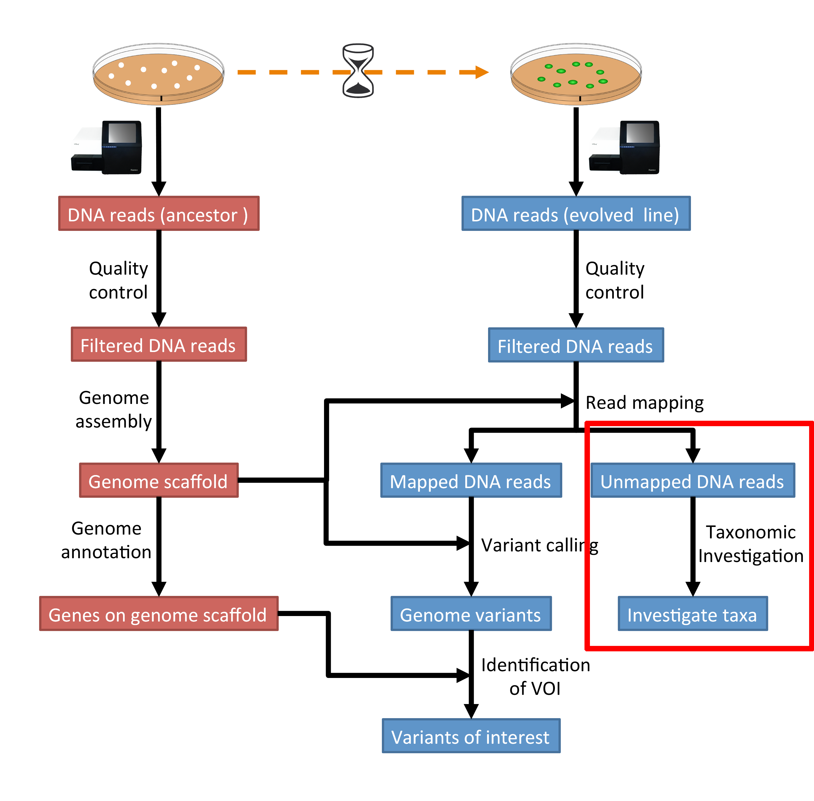
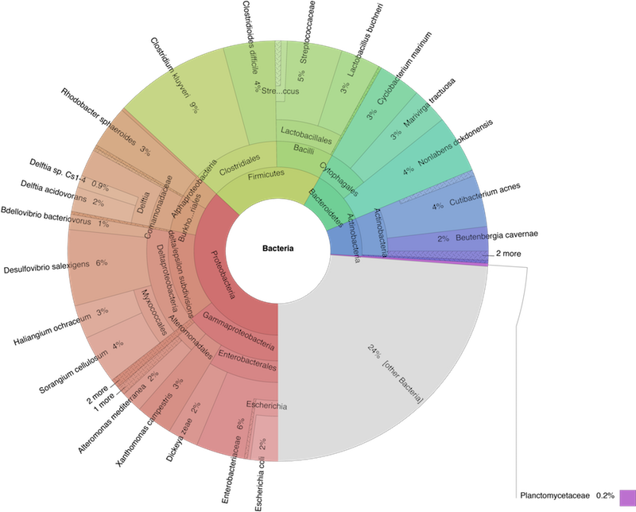

.. _taxonomic-investigation:

Taxonomic investigation
=======================

Preface
-------

We want to investigate if there are sequences of other species in our collection of sequenced DNA pieces.
We hope that most of them are from our species that we try to study, i.e. the DNA that we have extracted and amplified.
This might be a way of quality control, e.g. have the samples been contaminated?
Lets investigate if we find sequences from other species in our sequence set.

We will use the tool |kraken| to assign taxonomic classifications to our sequence reads.
Let us see if we can id some sequences from other species.

.. NOTE::

   You will encounter some **To-do** sections at times. Write the solutions and answers into a text-file.

Overview
--------

The part of the workflow we will work on in this section can be viewed in :numref:`fig-workflow-taxa`.

.. _fig-workflow-taxa:

   The part of the workflow we will work on in this section marked in red.

Before we start
---------------

Lets see how our directory structure looks so far:

.. code:: bash

          cd ~/analysis
          ls -1F

.. code:: bash

          assembly/
          data/
          mappings/
          trimmed/
          trimmed-fastqc/

Kraken2
-------

We will be using a tool called |kraken| [WOOD2014]_.
This tool uses k-mers to assign a taxonomic labels in form of |ncbitax| to the sequence (if possible).
The taxonomic label is assigned based on similar k-mer content of the sequence in question to the k-mer content of reference genome sequence.
The result is a classification of the sequence in question to the most likely taxonomic label.
If the k-mer content is not similar to any genomic sequence in the database used, it will not assign any taxonomic label.

Installation
^^^^^^^^^^^^

Use conda in the same fashion as before to install |kraken|.
However, we are going to install kraken into its own environment:

.. code-block:: bash

   conda create --yes -n kraken kraken2 bracken
   conda activate kraken

Now we create a directory where we are going to do the analysis and we will change into that directory too.

.. code-block:: bash

   # make sure you are in your analysis root folder
   cd ~/analysis

   # create dir
   mkdir kraken
   cd kraken

Now we need to create or download a |kraken| database that can be used to assign the taxonomic labels to sequences.
We opt for downloading the pre-build "minikraken2" database from the |kraken| website:

.. code-block:: bash

   curl -O ftp://ftp.ccb.jhu.edu/pub/data/kraken2_dbs/minikraken2_v2_8GB_201904_UPDATE.tgz

   # alternatively we can use wget
   wget ftp://ftp.ccb.jhu.edu/pub/data/kraken2_dbs/minikraken2_v2_8GB_201904_UPDATE.tgz

   # once the download is finished, we need to extract the archive content:
   tar -xvzf minikraken2_v2_8GB_201904_UPDATE.tgz

.. ATTENTION::
   Should the download fail. Please find links to alternative locations on the
   :ref:`downloads` page.

.. NOTE::
   The "minikraken2" database was created from bacteria, viral and archaea sequences.
   What are the implications for us when we are trying to classify our sequences?

Usage
^^^^^

Now that we have installed |kraken| and downloaded and extracted the minikraken2 database, we can attempt to investigate the sequences we got back from the sequencing provider for other species as the one it should contain.
We call the |kraken| tool and specify the database and fasta-file with the sequences it should use. The general command structure looks like this:

.. code:: bash

   kraken2 --use-names --threads 4 --db PATH_TO_DB_DIR --report example.report.txt example.fa > example.kraken

However, we may have fastq-files, so we need to use ``--fastq-input`` which tells |kraken| that it is dealing with fastq-formated files.
In addition, we are dealing with paired-end data, which we can tell |kraken| with the switch ``--paired``.
Here, we are investigating one of the unmapped paired-end read files of the evolved line.

.. code:: bash

   kraken2 --use-names --threads 4 --db minikraken2_v2_8GB_201904_UPDATE --fastq-input --report evolved-6 --paired ../mappings/evolved-6.sorted.unmapped.R1.fastq ../mappings/evolved-6.sorted.unmapped.R2.fastq > evolved-6.kraken

This classification may take a while, depending on how many sequences we are going to classify.
The resulting content of the file "evolved-6.kraken" looks similar to the following example:

.. include:: example-kraken.txt
   :literal:
   :end-line: 5

Each sequence classified by |kraken| results in a single line of output.
Output lines contain five tab-delimited fields; from left to right, they are:

1. ``C/U``: one letter code indicating that the sequence was either classified or unclassified.
2. The sequence ID, obtained from the FASTA/FASTQ header.
3. The taxonomy ID |kraken| used to label the sequence; this is **0** if the sequence
   is unclassified and otherwise should be the |ncbitax| identifier.
4. The length of the sequence in bp.
5. A space-delimited list indicating the lowest common ancestor (in the
   taxonomic tree) mapping of each k-mer in the sequence.
   For example, ``562:13 561:4 A:31 0:1 562:3`` would indicate that:

   * the first 13 k-mers mapped to taxonomy ID #562
   * the next 4 k-mers mapped to taxonomy ID #561
   * the next 31 k-mers contained an ambiguous nucleotide
   * the next k-mer was not in the database
   * the last 3 k-mers mapped to taxonomy ID #562

.. NOTE::
   The |kraken| manual can be accessed `here <https://www.ccb.jhu.edu/software/kraken2/index.shtml?t=manual>`__.

Investigate taxa
^^^^^^^^^^^^^^^^

We can use the webpage `NCBI TaxIdentifier <https://www.ncbi.nlm.nih.gov/Taxonomy/TaxIdentifier/tax_identifier.cgi>`__ to quickly get the names to the taxonomy identifier.
However, this is impractical as we are dealing potentially with many sequences.
|kraken| has some scripts that help us understand our results better.

Because we used the |kraken| switch ``--report FILE``, we have got also a sample-wide report of all taxa found.
This is much better to get an overview what was found.

The first few lines of an example report are shown below.

.. include:: example-kraken-report.txt
   :literal:
   :end-line: 10

The output of kraken-report is tab-delimited, with one line per taxon.
The fields of the output, from left-to-right, are as follows:

1. **Percentage** of reads covered by the clade rooted at this taxon
2. **Number of reads** covered by the clade rooted at this taxon
3. **Number of reads** assigned directly to this taxon
4. A rank code, indicating **(U)nclassified, (D)omain, (K)ingdom, (P)hylum, (C)lass, (O)rder, (F)amily, (G)enus, or (S)pecies**. All other ranks are simply **"-"**.
5. |ncbitax| ID
6. The indented scientific name

.. NOTE::
   If you want to compare the taxa content of different samples to another, one can create a report whose structure is always the same for all samples, disregarding which taxa are found (obviously the percentages and numbers will be different).

We can cerate such a report using the option ``--report-zero-counts`` which will print out all taxa (instead of only those found).
We then sort the taxa according to taxa-ids (column 5), e.g. ``sort -n -k5``.

The report is not ordered according to taxa ids and contains all taxa in the database, even if they have not been found in our sample and are thus zero.
The columns are the same as in the former report, however, we have more rows and they are now differently sorted, according to the |ncbitax| id.

Bracken
^^^^^^^

|bracken| stands for Bayesian Re-estimation of Abundance with KrakEN, and is a statistical method that computes the abundance of species in DNA sequences from a metagenomics sample [LU2017]_.
|bracken| uses the taxonomy labels assigned by |kraken| (see above) to estimate the number of reads originating from each species present in a sample.
|bracken| classifies reads to the best matching location in the taxonomic tree, but does not estimate abundances of species.
Combined with the Kraken classifier, |bracken| will produces more accurate species- and genus-level abundance estimates than |kraken| alone.

The use of |bracken| subsequent to |kraken| is optional but might improve on the |kraken| results.

Installation
""""""""""""

We installed |bracken| already together with |kraken| above, so it should be ready to be used. 
We also downloaded the |bracken| files together with the minikraken2 database above, so we are good to go.

Usage
"""""

Now, we can use |bracken| on the |kraken| results to improve them.

The general structure of the |bracken| command look like this:

.. code:: bash

    bracken -d PATH_TO_DB_DIR -i kraken2.report -o bracken.species.txt -l S

- ``-l S``: denotes the level we want to look at. ``S`` stands for species but other levels are available.
- ``-d PATH_TO_DB_DIR``: specifies the path to the |kraken| database that should be used.

Let us apply |bracken| to the example above:

.. code:: bash

    bracken -d minikraken2_v2_8GB_201904_UPDATE -i evolved-6.kraken -l S -o evolved-6.bracken

The species-focused result-table looks similar to this:

.. include:: example-bracken.txt
   :literal:
   :end-line: 9

The important column is the ``new_est_reads``, which gives the newly estimated reads.

Centrifuge
----------

We can also use another tool by the same group called |centrifuge| [KIM2017]_.
This tool uses a novel indexing scheme based on the Burrows-Wheeler transform (BWT) and the Ferragina-Manzini (FM) index, optimized specifically for the metagenomic classification problem to assign a taxonomic labels in form of |ncbitax| to the sequence (if possible).
The result is a classification of the sequence in question to the most likely taxonomic label.
If the search sequence is not similar to any genomic sequence in the database used, it will not assign any taxonomic label.

.. note::  I would normally use |kraken| and only prefer |centrifuge| if memory and/or speed are an issue .

Installation
^^^^^^^^^^^^

Use conda in the same fashion as before to install |centrifuge|:

.. code-block:: bash

   conda create --yes -n centrifuge centrifuge
   conda activate centrifuge

Now we create a directory where we are going to do the analysis and we will change into that directory too.

.. code-block:: bash

   # make sure you are in your analysis root folder
   cd ~/analysis

   # create dir
   mkdir centrifuge
   cd centrifuge

Now we need to create or download a |centrifuge| database that can be used to assign the taxonomic labels to sequences.
We opt for downloading the pre-build database from the |centrifuge| website:

.. code-block:: bash

   curl -O ftp://ftp.ccb.jhu.edu/pub/infphilo/centrifuge/data/p_compressed+h+v.tar.gz

   # alternatively we can use wget
   wget ftp://ftp.ccb.jhu.edu/pub/infphilo/centrifuge/data/p_compressed+h+v.tar.gz

   # once the download is finished, we need to extract the archive content
   # It will extract a few files from the archive and may take a moment to finish.
   tar -xvzf p_compressed+h+v.tar.gz

.. ATTENTION::
   Should the download fail. Please find links to alternative locations on the
   :ref:`downloads` page.

.. NOTE::
   The database we will be using was created from bacteria and archaea sequences only.
   What are the implications for us when we are trying to classify our sequences?

Usage
^^^^^

Now that we have installed |centrifuge| and downloaded and extracted the pre-build database, we can attempt to investigate the sequences we got back from the sequencing provider for other species as the one it should contain.
We call the |centrifuge| tool and specify the database and fasta-file with the sequences it should use. The general command structure looks like this:

.. code:: bash

   centrifuge -x p_compressed+h+v -U example.fa --report-file report.txt -S results.txt

However, if we do not have fastq-files we may have to use the  ``-f`` option, which tells |centrifuge| that it is dealing with a fasta-formated file.
Here, we are investigating one of the unmapped paired-end read files of the evolved line.

.. code:: bash

   centrifuge -x p_compressed+h+v -U ../mappings/evolved-6.sorted.unmapped.R1.fastq --report-file evolved-6-R1-report.txt -S evolved-6-R1-results.txt

This classification may take a moment, depending on how many sequences we are going to classify.
The resulting content of the file ``evolved-6-R1-results.txt`` looks similar to the following example:

.. include:: example-centrifuge-results.txt
   :literal:
   :end-line: 5

Each sequence classified by |centrifuge| results in a single line of output.
Output lines contain eight tab-delimited fields; from left to right, they are according to the |centrifuge| website:

1. The read ID from a raw sequencing read.
2. The sequence ID of the genomic sequence, where the read is classified.
3. The taxonomic ID of the genomic sequence in the second column.
4. The score for the classification, which is the weighted sum of hits.
5. The score for the next best classification.
6. A pair of two numbers: (1) an approximate number of base pairs of the read that match the genomic sequence and (2) the length of a read or the combined length of mate pairs.
7. A pair of two numbers: (1) an approximate number of base pairs of the read that match the genomic sequence and (2) the length of a read or the combined length of mate pairs.
8. The  number of classifications for this read, indicating how many assignments were made.

Investigate taxa
^^^^^^^^^^^^^^^^

Centrifuge report
"""""""""""""""""

The command above creates a |centrifuge| report automatically for us.
It contains an overview of the identified taxa and their abundances in your supplied sequences (normalised to genomic length):

.. include:: example-centrifuge-report.txt
   :literal:
   :end-line: 6

Each line contains seven tab-delimited fields; from left to right, they are according to the |centrifuge| website:

1. The name of a genome, or the name corresponding to a taxonomic ID (the second column) at a rank higher than the strain.
2. The taxonomic ID.
3. The taxonomic rank.
4. The length of the genome sequence.
5. The number of reads classified to this genomic sequence including multi-classified reads.
6. The number of reads uniquely classified to this genomic sequence.
7. The proportion of this genome normalized by its genomic length.

Kraken-like report
""""""""""""""""""

If we would like to generate a report as generated with the former tool |kraken|, we can do it like this:

.. code::

   centrifuge-kreport -x p_compressed+h+v evolved-6-R1-results.txt > evolved-6-R1-kreport.txt

.. include:: example-centrifuge-kreport.txt
   :literal:
   :end-line: 20

This gives a similar (not the same) report as the |kraken| tool. The report is tab-delimited, with one line per taxon. The fields of the output, from left-to-right, are as follows:

1. Percentage of reads covered by the clade rooted at this taxon
2. Number of reads covered by the clade rooted at this taxon
3. Number of reads assigned directly to this taxon
4. A rank code, indicating (U)nclassified, (D)omain, (K)ingdom, (P)hylum, (C)lass, (O)rder, (F)amily, (G)enus, or (S)pecies. All other ranks are simply “-“.
5. NCBI Taxonomy ID
6. The indented scientific name

Visualisation (Krona)
---------------------

We use the |krona| tools to create a nice interactive visualisation of the taxa content of our sample [ONDOV2011]_.
:numref:`fig-krona` shows an example (albeit an artificial one) snapshot of the visualisation |krona| provides.
:numref:`fig-krona` is a snapshot of the `interactive web-page <../_static/taxonomy.krona.html>`_ similar to the one we try to create.

.. _fig-krona:

   Example of an Krona output webpage.

Installation
^^^^^^^^^^^^

Install |krona| with:

.. code-block:: bash

   source activate ngs
   conda install krona

First some house-keeping to make the |krona| installation work.
Do not worry to much about what is happening here.

.. code-block:: bash

   # we delete a symbolic link that is not correct
   rm -rf ~/miniconda3/envs/ngs/opt/krona/taxonomy

   # we create a directory in our home where the krona database will live
   mkdir -p ~/krona/taxonomy

   # now we make a symbolic link to that directory
   ln -s ~/krona/taxonomy ~/miniconda3/envs/ngs/opt/krona/taxonomy

Build the taxonomy
^^^^^^^^^^^^^^^^^^

We need to build a taxonomy database for |krona|.
However, if this fails we will skip this step and just download a pre-build one.
Lets first try to build one.

.. code-block:: bash

   ktUpdateTaxonomy.sh ~/krona/taxonomy

Now, if this fails, we download a pre-build taxonomy database for krona:

.. code-block:: bash

   # Download pre-build database
   curl -O http://compbio.massey.ac.nz/data/taxonomy.tab.gz

   # we unzip the file
   gzip -d taxonomy.tab.gz

   # we move the unzipped file to our taxonomy directory we specified in the step before.
   mv taxonomy.tab ~/krona/taxonomy

.. ATTENTION::
   Should this also fail we can download a pre-build database on the :ref:`downloads` page via a browser.

Visualise
^^^^^^^^^

Now, we use the tool ``ktImportTaxonomy`` from the |krona| tools to create the html web-page.
We first need build a two column file (``read_id<tab>tax_id``) as input to the ``ktImportTaxonomy`` tool.
We will do this by cutting the columns out of either the |kraken| or |centrifuge| results:

.. code:: bash

   # Kraken2
   cd kraken
   cat evolved-6.kraken | cut -f 2,3 > evolved-6.kraken.krona
   ktImportTaxonomy evolved-6.kraken.krona
   firefox taxonomy.krona.html

   # Centrifuge
   cd centrifuge
   cat evolved-6-R1-results.txt | cut -f 1,3 > evolved-6-R1-results.krona
   ktImportTaxonomy evolved-6-R1-results.krona
   firefox taxonomy.krona.html

What happens here is that we extract the second and third column from the |kraken| results.
Afterwards, we input these to the |krona| script, and open the resulting web-page in a bowser.
Done!

.. only:: html

   .. rubric:: References

.. [KIM2017] Kim D, Song L, Breitwieser FP, Salzberg SL. Centrifuge: rapid and
             sensitive classification of metagenomic sequences. `Genome Res. 2016 Dec;26(12):1721-1729 <https://www.ncbi.nlm.nih.gov/pubmed/27852649>`__

.. [LU2017] Lu J, Breitwieser FP, Thielen P, Salzberg SL. Bracken: estimating species abundance in metagenomics data. `PeerJ Computer Science, 2017, 3:e104, doi:10.7717/peerj-cs.104 <https://peerj.com/articles/cs-104/>`__

.. [ONDOV2011] Ondov BD, Bergman NH, and Phillippy AM. Interactive metagenomic visualization in a Web browser. `BMC Bioinformatics, 2011, 12(1):385. <http://www.ncbi.nlm.nih.gov/pubmed/21961884>`__

.. [WOOD2014] Wood DE and Steven L Salzberg SL. Kraken: ultrafast metagenomic sequence classification using exact alignments. `Genome Biology, 2014, 15:R46. DOI: 10.1186/gb-2014-15-3-r46 <http://doi.org/10.1186/gb-2014-15-3-r46>`__.

