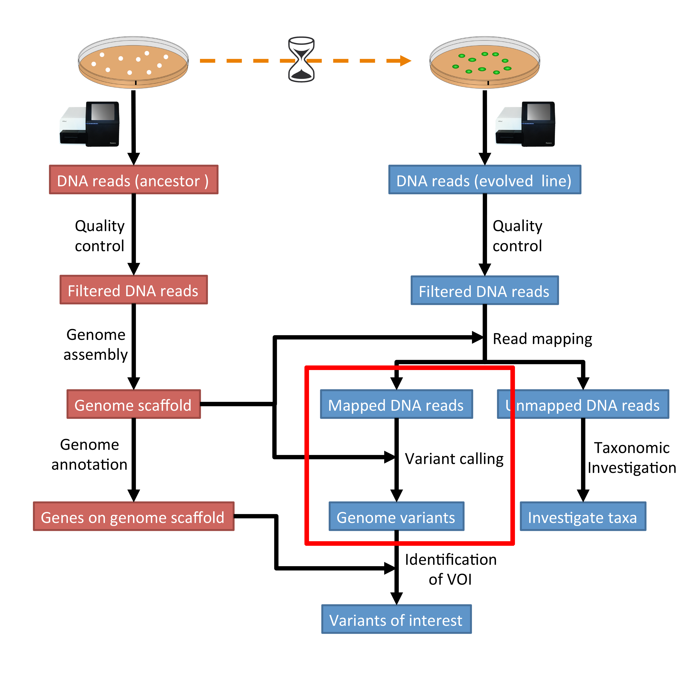
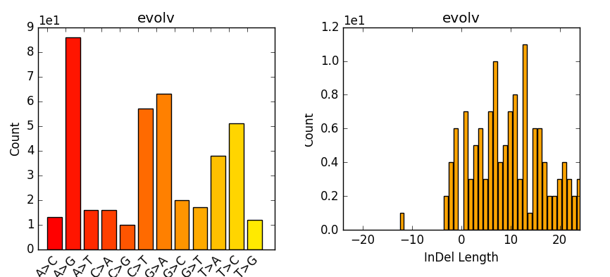

.. _ngs-variantcalling:

Variant calling
===============

Preface
-------

In this section we will use our genome assembly based on the ancestor and call genetic variants in the evolved line [NIELSEN2011]_.

.. There is an accompanying lecture for this tutorial (`SNPs - GWAS - eQTLs introduction <http://dx.doi.org/10.6084/m9.figshare.1515026>`__).

.. NOTE`::

   You will encounter some **To-do** sections at times. Write the solutions and answers into a text-file.   

Overview
--------

The part of the workflow we will work on in this section can be viewed in :numref:`fig-workflow-var`.

.. _fig-workflow-var:

   The part of the workflow we will work on in this section marked in red.
   
     
Learning outcomes
-----------------

After studying this tutorial section you should be able to:

#. Use tools to call variants based on a reference genome.
#, Be able to describe what influences the calling of variants.

Before we start
---------------

Lets see how our directory structure looks so far:

.. code:: sh

    $ cd ~/analysis
    $ ls -1F

.. code:: sh

    assembly/
    data/
    kraken/
    mappings/
    multiqc_data/
    trimmed/
    trimmed-fastqc/

.. attention::

    If you have not run the previous section on :ref:`ngs-mapping`, you can download the mapped data needed for this section here: :ref:`downloads`.

   
Installing necessary software
-----------------------------
  
Tools we are going to use in this section and how to intall them if you not have done it yet.

.. code:: sh

    # activate the env
    $ conda create --yes -n var samtools bamtools freebayes bedtools vcflib rtg-tools bcftools matplotlib
    $ conda activate var

          
Preprocessing
-------------

We first need to make an index of our reference genome as this is required by the SNP caller.
Given a scaffold/contig file in fasta-format, e.g. ``scaffolds.fasta`` which is located in the directory ``assembly/``, use |samtools| to do this:

.. code:: sh
          
    $ samtools faidx assembly/scaffolds.fasta
   

Furthermore we need to pre-process our mapping files a bit further and create a bam-index file (``.bai``) for the bam-file we want to work with:

.. code:: sh
               
    $ bamtools index -in mappings/evol1.sorted.dedup.q20.bam

Lets also create a new directory for the variants:

.. code:: sh

    $ mkdir variants

          
Calling variants
----------------

.. SAMtools mpileup
.. ~~~~~~~~~~~~~~~~

.. We use the sorted filtered bam-file that we produced in the mapping step before.

.. .. code:: sh

..     # We first pile up all the reads and then call variants
..     $ samtools mpileup -u -g -f assembly/scaffolds.fasta mappings/evol1.sorted.dedup.q20.bam | bcftools call -v -m -O z -o variants/evol1.mpileup.vcf.gz
   
.. |samtools| mpileup parameter:

.. - ``-u``: uncompressed output
.. - ``-g``: generate genotype likelihoods in BCF format
.. - ``-f FILE``: faidx indexed reference sequence file
  
.. |bcftools| view parameter:

.. - ``-v``: output variant sites only
.. - ``-m``: alternative model for multiallelic and rare-variant calling
.. - ``-o``: output file-name
.. - ``-O z``: output type: 'z' compressed VCF

  
Freebayes
~~~~~~~~~

We can call variants with a tool called |freebayes|.
Given a reference genome scaffold file in fasta-format, e.g. ``scaffolds.fasta`` and the index in ``.fai`` format and a mapping file (.bam file) and a mapping index (.bai file), we can call variants with |freebayes| like so:

.. code:: sh

    # Now we call variants and pipe the results into a new file
    $ freebayes -p 1 -f assembly/scaffolds.fasta mappings/evol1.sorted.dedup.q20.bam > variants/evol1.freebayes.vcf

- ``-p 1``: specifies the ploidy level. *E.Coli* are haploid.

Post-processing
---------------

Understanding the output files (.vcf)
~~~~~~~~~~~~~~~~~~~~~~~~~~~~~~~~~~~~~

Lets look at a vcf-file:

.. code:: sh

    # first 10 lines, which are part of the header
    $ cat variants/evol1.freebayes.vcf | head

          
.. code:: sh
   
    ##fileformat=VCFv4.2
    ##fileDate=20200122
    ##source=freeBayes v1.3.1-dirty
    ##reference=assembly/scaffolds.fasta
    ##contig=<ID=NODE_1_length_348724_cov_30.410613,length=348724>
    ##contig=<ID=NODE_2_length_327290_cov_30.828326,length=327290>
    ##contig=<ID=NODE_3_length_312063_cov_30.523209,length=312063>
    ##contig=<ID=NODE_4_length_202800_cov_31.500777,length=202800>
    ##contig=<ID=NODE_5_length_164027_cov_28.935175,length=164027>
    ##contig=<ID=NODE_6_length_144088_cov_29.907986,length=144088>

Lets look at the variants:

.. code:: sh
               
    # remove header lines and look at top 4 entires
    $ cat variants/evol1.freebayes.vcf | grep -v '##' | head -4

          
.. code:: sh
          
    #CHROM  POS     ID      REF     ALT     QUAL    FILTER  INFO    FORMAT  unknown
    NODE_1_length_348724_cov_30.410613      375     .       A       C       0       .       AB=0;ABP=0;AC=0;AF=0;AN=1;AO=3;CIGAR=1X;DP=21;DPB=21;DPRA=0;EPP=3.73412;EPPR=3.49285;GTI=0;LEN=1;MEANALT=1;MQM=44;MQMR=40.3333;NS=1;NUMALT=1;ODDS=63.5226;PAIRED=1;PAIREDR=1;PAO=0;PQA=0;PQR=0;PRO=0;QA=53;QR=414;RO=18;RPL=2;RPP=3.73412;RPPR=7.35324;RPR=1;RUN=1;SAF=3;SAP=9.52472;SAR=0;SRF=14;SRP=15.074;SRR=4;TYPE=snp       GT:DP:AD:RO:QR:AO:QA:GL      0:21:18,3:18:414:3:53:0,-29.6927
    NODE_1_length_348724_cov_30.410613      393     .       T       A       0       .       AB=0;ABP=0;AC=0;AF=0;AN=1;AO=2;CIGAR=1X;DP=24;DPB=24;DPRA=0;EPP=7.35324;EPPR=6.56362;GTI=0;LEN=1;MEANALT=1;MQM=36;MQMR=42.9545;NS=1;NUMALT=1;ODDS=127.074;PAIRED=1;PAIREDR=1;PAO=0;PQA=0;PQR=0;PRO=0;QA=21;QR=717;RO=22;RPL=2;RPP=7.35324;RPPR=3.0103;RPR=0;RUN=1;SAF=2;SAP=7.35324;SAR=0;SRF=17;SRP=17.2236;SRR=5;TYPE=snp       GT:DP:AD:RO:QR:AO:QA:GL      0:24:22,2:22:717:2:21:0,-57.4754
    NODE_1_length_348724_cov_30.410613      612     .       A       C       2.32041e-15     .       AB=0;ABP=0;AC=0;AF=0;AN=1;AO=3;CIGAR=1X;DP=48;DPB=48;DPRA=0;EPP=9.52472;EPPR=11.1654;GTI=0;LEN=1;MEANALT=1;MQM=60;MQMR=60;NS=1;NUMALT=1;ODDS=296.374;PAIRED=1;PAIREDR=0.977778;PAO=0;PQA=0;PQR=0;PRO=0;QA=53;QR=1495;RO=45;RPL=0;RPP=9.52472;RPPR=3.44459;RPR=3;RUN=1;SAF=3;SAP=9.52472;SAR=0;SRF=19;SRP=5.37479;SRR=26;TYPE=snp  GT:DP:AD:RO:QR:AO:QA:GL      0:48:45,3:45:1495:3:53:0,-129.869

The fields in a vcf-file are described in he table (:numref:`table-vcf`) below:

.. _table-vcf:
.. table:: The vcf-file format fields.

   +-----+-----------+--------------------------------------------------------------------------------------+
   | Col | Field     | Description                                                                          |
   +=====+===========+======================================================================================+
   | 1   | CHROM     | Chromosome name                                                                      |
   +-----+-----------+--------------------------------------------------------------------------------------+
   | 2   | POS       | 1-based position. For an indel, this is the position preceding the indel.            |
   +-----+-----------+--------------------------------------------------------------------------------------+
   | 3   | ID        | Variant identifier. Usually the dbSNP rsID.                                          |
   +-----+-----------+--------------------------------------------------------------------------------------+
   | 4   | REF       | Reference sequence at POS involved in the variant. For a SNP, it is a single base.   |
   +-----+-----------+--------------------------------------------------------------------------------------+
   | 5   | ALT       | Comma delimited list of alternative seuqence(s).                                     |
   +-----+-----------+--------------------------------------------------------------------------------------+
   | 6   | QUAL      | Phred-scaled probability of all samples being homozygous reference.                  |
   +-----+-----------+--------------------------------------------------------------------------------------+
   | 7   | FILTER    | Semicolon delimited list of filters that the variant fails to pass.                  |
   +-----+-----------+--------------------------------------------------------------------------------------+
   | 8   | INFO      | Semicolon delimited list of variant information.                                     |
   +-----+-----------+--------------------------------------------------------------------------------------+
   | 9   | FORMAT    | Colon delimited list of the format of individual genotypes in the following fields.  |
   +-----+-----------+--------------------------------------------------------------------------------------+ 
   | 10+ | Sample(s) | Individual genotype information defined by FORMAT.                                   |
   +-----+-----------+--------------------------------------------------------------------------------------+

Statistics
~~~~~~~~~~

Now we can use it to do some statistics and filter our variant calls.

First, to prepare out vcf-file for querying we need to index it with ``tabix``:

.. code:: sh

    # compress file 
    $ bgzip variants/evol1.freebayes.vcf
    # index
    $ tabix -p vcf variants/evol1.freebayes.vcf.gz

- ``-p vcf``: input format 

We can get some quick stats with ``rtg vcfstats``:

.. code:: sh
               
    $ rtg vcfstats variants/evol1.freebayes.vcf.gz

   
Example output from ``rtg vcfstats``:

.. code:: sh

    Location                     : variants/evol1.freebayes.vcf.gz
    Failed Filters               : 0
    Passed Filters               : 35233
    SNPs                         : 55
    MNPs                         : 6
    Insertions                   : 3
    Deletions                    : 5
    Indels                       : 0
    Same as reference            : 35164
    SNP Transitions/Transversions: 0.83 (25/30)
    Total Haploid                : 69
    Haploid SNPs                 : 55
    Haploid MNPs                 : 6
    Haploid Insertions           : 3
    Haploid Deletions            : 5
    Haploid Indels               : 0
    Insertion/Deletion ratio     : 0.60 (3/5)
    Indel/SNP+MNP ratio          : 0.13 (8/61)

   

   
However, we can also run |bcftools| to extract more detailed statistics about our variant calls:
   

.. code:: sh
               
    $ bcftools stats -F assembly/scaffolds.fasta -s - variants/evol1.freebayes.vcf.gz > variants/evol1.freebayes.vcf.gz.stats

- ``-s -``: list of samples for sample stats, "-" to include all samples
- ``-F FILE``: faidx indexed reference sequence file to determine INDEL context

  
Now we take the stats and make some plots (e.g. :numref:`fig-vcfstats`) which are particular of interest if having multiple samples, as one can easily compare them. However, we are only working with one here:

.. code:: sh
   
    $ mkdir variants/plots
    $ plot-vcfstats -p variants/plots/ variants/evol1.freebayes.vcf.gz.stats

   
- ``-p``: The output files prefix, add a slash at the end to create a new directory.
   

.. _fig-vcfstats:

            
    Example of ``plot-vcfstats`` output.

Variant filtration
~~~~~~~~~~~~~~~~~~

Variant filtration is a big topic in itself [OLSEN2015]_.
There is no consens yet and research on how to best filter variants is ongoing.

We will do some simple filtration procedures here.
For one, we can filter out low quality reads.

Here, we only include variants that have quality > 30.

.. code:: sh

    # use rtg vcfffilter
    $ rtg vcffilter -q 30 -i variants/evol1.freebayes.vcf.gz -o variants/evol1.freebayes.q30.vcf.gz

- ``-i FILE``: input file
- ``-o FILE``: output file
- ``-q FLOAT``: minimal allowed quality in output.

or use |vcflib|:

.. code:: sh

    # or use vcflib
    $ zcat variants/evol1.freebayes.vcf.gz  | vcffilter -f "QUAL >= 30" | gzip > variants/evol1.freebayes.q30.vcf.gz

- ``-f "QUAL >= 30"``: we only include variants that have been called with quality >= 30.

Quick stats for the filtered variants:

.. code:: sh

    # look at stats for filtered
    $ rtg vcfstats variants/evol1.freebayes.q30.vcf.gz

|freebayes| adds some extra information to the vcf-files it creates.
This allows for some more detailed filtering.
This strategy will NOT work on calls done with e.g. |samtools|/bcftools mpileup called variants.
Here we filter, based on some recommendation form the developer of |freebayes|:

.. code:: sh

   $ zcat variants/evol1.freebayes.vcf.gz | vcffilter -f "QUAL > 1 & QUAL / AO > 10 & SAF > 0 & SAR > 0 & RPR > 1 & RPL > 1" | gzip > variants/evol1.freebayes.filtered.vcf.gz

- ``QUAL > 1``: removes really bad sites
- ``QUAL / AO > 10``: additional contribution of each obs should be 10 log units (~ Q10 per read)
- ``SAF > 0 & SAR > 0``: reads on both strands
- ``RPR > 1 & RPL > 1``: at least two reads “balanced” to each side of the site

.. todo::

   Look at the statistics. One ratio that is mentioned in the statistics is transition transversion ratio (*ts/tv*).
   Explain what this ratio is and why the observed ratio makes sense.

.. todo::

    Call and filter variants for the second evolved strain, similarily to what ws described here for the first strain.

This strategy used here will do for our purposes.
However, several more elaborate filtering strategies have been explored, e.g. `here <https://github.com/ekg/freebayes#observation-filters-and-qualities>`__.

.. only:: html

   .. rubric:: References

.. [NIELSEN2011] Nielsen R, Paul JS, Albrechtsen A, Song YS. Genotype and SNP calling from next-generation sequencing data. `Nat Rev Genetics, 2011, 12:433-451 <http://doi.org/10.1038/nrg2986>`__

.. [OLSEN2015] Olsen ND et al. Best practices for evaluating single nucleotide variant calling methods for microbial genomics. `Front. Genet., 2015, 6:235. <https://doi.org/10.3389/fgene.2015.00235>`__
